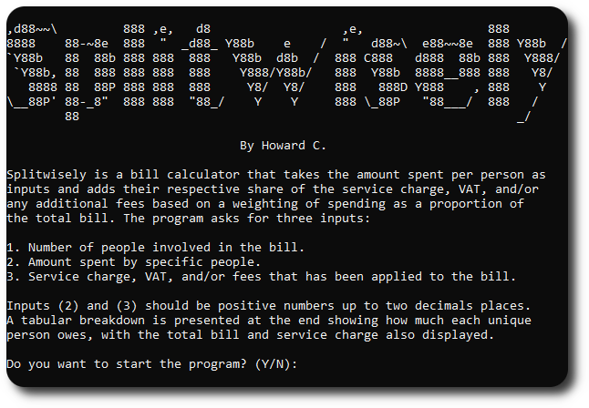

# Splitwisely
Splitwisely is a bill calculator that takes the amount spent per person and adds their respective share of the service charge, VAT, and/or additional fees based on a weighting of how much they spent with respect to the total bill. The program will ask for the number of people involved in the bill, the amount spent by specific people and additional fees (e.g. service charge, VAT). A breakdown is presented at the end showing how much each unique person owes, with the total bill and service charge also displayed.

## Installation
Clone the repository as follows.

`git clone https://github.com/h-cwc/splitwisely`

Compile the program locally in the command line as follows.

`gcc -o splitwisely splitwisely.c`

A program splitwisely.exe should be compiled. Now you can split bills as required.